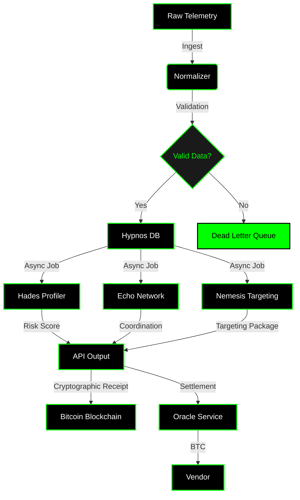

# GH Systems
**Crypto Intelligence Platform for Government Agencies**

*ABC (Adversarial Behavior Compiler) compiles vendor intelligence into actionable targeting packages*

Copyright (c) 2025 GH Systems. All rights reserved.

<div align="left">
  
</div>

[](LICENSE)

📄 **[Whitepaper PDF](Deal%20Room/GH%20Behavioral%20Intel%20%5Bv1%5D.pdf)** | 📊 **[Threat Dossiers](examples/demo_dossiers/)** | 🧠 **[Ontology Spec](Deal%20Room/GH_ONTOLOGY_SPEC.md)** | 📖 **[Glossary](GLOSSARY.md)**

---

## What GH Systems Is

Government agencies spend tens of millions on crypto intelligence. They receive forensic reports that arrive days late. ABC sits on top of existing vendors (Chainalysis, TRM, Chaos, research feeds) and compiles their telemetry into actor playbooks that answer the question Treasury actually asks: **"What happens next, and how do we stop it?"**

**The Problem:**
```
Agency request → single-vendor contract → historical forensics → 7-day analyst merge → "Here's what happened."
```

**The Solution:**
```
Agency request → multi-vendor feeds → ABC compiles in <500ms → "Here's what happens in 48h; here's how to stop it."
→ Cryptographic receipt → Bitcoin settlement (4 hours) → Verifiable intelligence
```

ABC does not replace forensics vendors—it makes them 10× more valuable to government customers.

---

## Three Core Advantages

### 1. Faster, Crypto-Native Payment Settlement

**4-hour settlement vs. 18-month procurement cycles**

- **Fiat-compatible interface**: Government clients pay in USD (FAR-compliant)
- **Bitcoin settlement to vendors**: Oracle/custodial service converts fiat to BTC
- **Automated payouts**: Vendors receive BTC when intelligence validates
- **No government hot wallets required**: Compliant intermediary handles conversion

**Note:** Bitcoin settlement is a capability, not a rigid requirement. The system supports fiat-to-BTC conversion via compliant oracle/custodial services (e.g., Prime, Coinbase Prime) for government clients who cannot hold Bitcoin directly.

**Impact:** Treasury posts USD payment; Oracle converts to BTC; vendor receives settlement within 4 hours (vs. 18-month traditional procurement).

---

### 2. Intelligence Compiler Shortens Investigation Time

**7 days → ~5 hours with pre-compiled actor playbooks**

- ABC runtime compiles intelligence in <500ms
- Unified intelligence from multiple vendors
- Automated correlation and pattern matching
- Pre-compiled actor playbooks ready for action

**Crypto-Native Intelligence:**
- Domain-native pattern recognition
- Decentralized signal analysis
- Attacker mindset modeling

**Impact:** Analysts reduced triage from 7 days to ~5 hours with compiled actor packages. Fills gaps legacy teams can't cover, especially in conflicts where crypto is used for financing, intelligence, or infrastructure attacks.

---

### 3. Cryptographically Provable Scores

**Cryptographic receipts make intelligence provable without revealing proprietary methods**

- Risk scores, behavioral signatures, and threat assessments verifiable on-chain
- Proof of authenticity without revealing proprietary methodology
- Intelligence becomes verifiable objects usable everywhere

**On-Chain Proof Layer:**
- Outputs are auditable
- Multi-party collaboration is feasible
- Evidence remains tamper-resistant

**Impact:** Intelligence becomes portable, trustworthy, and usable in any system. Enables trust without revealing proprietary systems. Invaluable in regional conflicts where credibility, attribution, and speed are crucial.

---

## How ABC Works

1. **Signal intake** — Ingest Chainalysis/TRM/Chaos/external research outputs (crypto intelligence)
2. **Hades** — Compile raw telemetry into actor signatures & risk posture
3. **Echo** — Surface coordination networks with confidence/provenance
4. **Nemesis** — Generate executable targeting packages ("freeze Exchange_A/B within 24h; confidence 0.84")
5. **Cryptographic receipts** — Generate minimal on-chain proofs (hash, timestamp, signature) without revealing proprietary systems
6. **Settlement** — Government clients pay in USD (FAR-compliant); Oracle converts to BTC; vendors receive payouts automatically when intelligence validates
7. **Output** — APIs, mesh connectors, or air-gapped delivery for Treasury, OFAC, FinCEN, DoD Cyber Command, allies

**Hypnos Core** is the long-term memory system that structures intelligence. Built on Hypnos Core, Hades profiles behavior, Echo detects coordination, and Nemesis generates targeting packages. Hypnos Core maintains long-term memory, consolidates patterns, and tracks dormant threats (see `hypnos/` for details).

### On-Chain Strategy

**Everything proprietary stays off-chain. Only tiny cryptographic proofs go on-chain.**

- **Off-Chain:** All AI models, full intelligence packages, proprietary systems
- **On-Chain:** Minimal cryptographic receipts (hash, timestamp, signature, minimal metadata)

This turns intelligence into **verifiable objects** that can be used everywhere—beyond settlements, into workflows. Intelligence becomes portable, trustworthy, and usable in any system.

---

## Architecture Diagram



---

## Current Status

**This repository represents the v2.0 architecture currently under development.**

### Implemented ✅
- **Core ingestion pipeline**: Pydantic schemas and validation (`src/schemas/`, `core/ingestion/validator.py`)
- **API endpoints**: FastAPI routes with error handling (`src/api/routes/ingest.py`)
- **Graph data structures**: NetworkX-based graph manipulation (`src/graph/builder.py`)
- **Fiat bridge**: FAR-compliant settlement system (`settlements/fiat_bridge.py`)
- **Cryptographic receipts**: Canonical JSON hashing and Merkle trees (`nemesis/on_chain_receipt/`)
- **AI ontology guardrails**: Data lake, validation layer, review queue, heuristic rules (`nemesis/ai_ontology/`)

### In Development 🚧
- **GNN inference engine**: Graph neural network relationship inference (currently using heuristic rules)
- **Production deployment**: Full containerization and orchestration
- **Vector database integration**: Long-term memory and context-aware classification
- **Real-time dashboard**: WebSocket-based threat monitoring interface

### Planned 📋
- **Full GNN implementation**: Replace heuristic rules with trained models
- **Multi-modal intelligence**: Text, transaction, graph, and temporal data processing
- **Federated mesh**: Multi-party intelligence sharing with cryptographic proofs

**We're honest about what works and what's being built. The core compilation pipeline is production-ready; advanced AI features are in active development.**

---

## AI-Powered Threat Ontology

ABC is not just a compiler—it's an **AI-powered threat ontology** that:

- **Learns** – Semantic understanding extracts entities from unstructured intelligence
- **Classifies** – Auto-classification categorizes threat actors, TTPs, and campaigns
- **Infers** – Graph neural networks discover hidden relationships
- **Predicts** – Forecasts adversary actions before they occur
- **Evolves** – Continuous learning improves from feedback and new data

See `nemesis/AI_THREAT_ONTOLOGY_SPEC.md` for complete architecture.

---

## Validated Results

- **100% OFAC wallet detection** – Flagged 3–6 months before public sanction designation
- **Investigation compression** – Analysts reduced triage from 7 days to ~5 hours with compiled actor packages
- **Risk reduction (modeled)** – Treasury desks projected up to 50% lower DeFi exposure once Hades and Nemesis throttled high-risk interactions
- **Inter-agency ROI (pilot estimate)** – Federated mesh users observed 37% fewer duplicated investigations and 22% less capital-at-risk
- **Bitcoin bounty validation** – Treasury posted 10 BTC bounty; ABC submitted package; funds released automatically within 4 hours (vs. 18-month traditional procurement)
- **AI-Powered Threat Ontology** – ABC now learns, evolves, and provides deeper intelligence than rule-based systems
- **On-Chain Cryptographic Receipts** – Everything proprietary stays off-chain. Only minimal cryptographic proofs go on-chain, turning intelligence into verifiable objects
- **Threat actor dossiers** – `nemesis/threat_profiles/` (e.g., Lazarus Group) provide operational playbooks with Hades/Echo/Nemesis outputs

---

## Expanding Beyond Crypto

**Future Bet:** We're betting crypto becomes infrastructure for warfare—autonomous systems, weapons, and infrastructure that run on Bitcoin.

**Proof-of-Concept:** Federal AI security intelligence dossiers (NASA-001, DoD-DHS-002) demonstrate compilation capability for government AI infrastructure vulnerabilities. This positions GH Systems for intelligence in battlefields where crypto connects cyber and physical domains.

See `nemesis/threat_profiles/THREAT_DOSSIER_NASA_001.md` and `nemesis/threat_profiles/THREAT_DOSSIER_DOD_DHS_002.md` for examples.

---

## Integration & Commercial Models

GH Systems does not compete with existing vendors—it amplifies them.

- **White-label license** ($100K–$300K/yr) → vendors upsell predictive intelligence (e.g., $2M → $3.5M contracts, ROI >600%)
- **Revenue-share overlay** (~30% of contract uplift) → no upfront cost for research firms
- **Strategic partnerships** → joint bids combining forensics + behavioral targeting (e.g., $5M contracts)

**Time to value:** 1–2 months for API/schema alignment, 2–3 months for live pilot, enhanced contracts by month 6.

### Integration Scenarios
- **Performance Bounty** – Treasury posts 10 BTC bounty; ABC submits validated package; funds release automatically within 4 hours (vs. 18-month procurement cycle)
- **Vendor Revenue Share** – Chainalysis $2M contract → $3.5M with ABC; split 70/30; quarterly BTC settlements
- **Allied Coordination Fund** – US Treasury + UK FIU + EU AML establish 100 BTC joint pool; 2-of-3 multisig payouts for cross-border intelligence

### Why Integrate Now: FY2026 Competitive Window
- **Q4 2025 (now):** FY2026 contract decisions underway. First vendor integrating ABC wins premium contracts; others remain forensic-only
- **Q1 2026:** FY2026 awards finalized—too late to integrate; late adopters wait until FY2027 (18-month disadvantage)
- **Integration timeline:** 4–6 months (API alignment + pilot). Decisions by December 2025 capture FY2026 renewal cycle

**Window for competitive advantage:** immediate through FY2026 decisions (12–18 months head start). After awards, predictive intelligence becomes expected, not premium.

---

## Repository Map

- `Deal Room/GH Behavioral Intel [v1].pdf` — Whitepaper
- `nemesis/threat_profiles/` — Threat dossiers (e.g., Lazarus Group)
- `nemesis/ai_ontology/` — AI-powered threat ontology implementation
- `nemesis/on_chain_receipt/` — Cryptographic receipt system
- `hades/`, `echo/`, `hypnos/` — Core components (profiling, coordination, memory)

---

## Next Steps

- **Read the whitepaper** – `Deal Room/GH Behavioral Intel [v1].pdf`
- **Explore threat dossiers** – `examples/demo_dossiers/`
- **Review glossary** – `GLOSSARY.md` (maps Greek gods to engineering domains)
- **Schedule integration workshop** – connect existing forensics feeds, receive compiled actor playbooks within weeks

**GH Systems** — Compiling behavioral bytecode so lawful actors win the economic battlefield.
