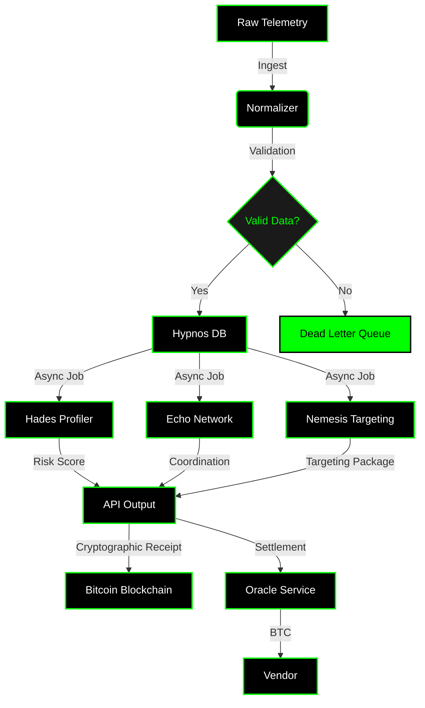

# Detailed Architecture Diagram (Mermaid)
**Local reference - not in main README**

This is the detailed Mermaid diagram showing the complete data flow. The main README uses the eye-catching custom image; this diagram provides the detailed technical flow for reference.

## Data Flow Description

1. **Raw Telemetry** - Vendor feeds (Chainalysis, TRM, Chaos, research feeds)
2. **Normalizer** - Data normalization and format standardization
3. **Validation** - Pydantic schema validation (compiler fails on bad data)
4. **Hypnos DB** - Long-term memory storage (validated data only)
5. **Dead Letter Queue** - Invalid data handling (error path)
6. **Hades Profiler** - Behavioral profiling and risk scoring (async)
7. **Echo Network** - Coordination detection (async)
8. **Nemesis Targeting** - Targeting package generation (async)
9. **API Output** - Compiled intelligence packages
10. **Bitcoin Blockchain** - Cryptographic receipts (OP_RETURN)
11. **Oracle Service** - Fiat-to-BTC conversion for government clients
12. **Vendor** - BTC settlement to intelligence providers

